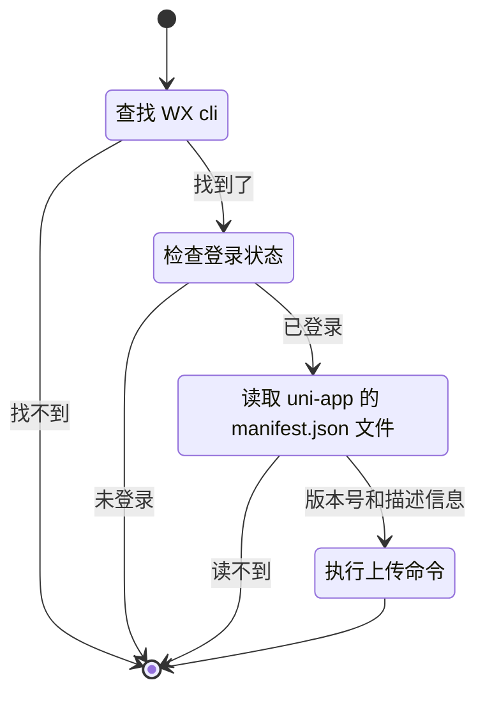

在使用 uni-app 开发微信小程序时，每次修改完 bug 并发版本后上传到微信都需要执行以下步骤：

1. 关闭当前的 `/dist/dev/mp-weixin`
2. 打开 `/dist/build/mp-weixin`
3. 点击工具->上传->确定
4. 输入版本号和项目备注
5. 最后点击上传按钮

这样的流程非常繁琐，那么一个成熟的前端，为了提高开发效率，高低的整一个 Vite 插件，实现小程序打包后自动上传到微信开发者工具。本文将从头到尾分解与总结这个插件的实现过程。

### 目标

首先呢还是我的习惯，确定目标，即实现一个 Vite 插件，能够在小程序打包完成后，自动将打包结果上传到微信开发者工具（设置为体验版）。

很简单，插件只要在 `closeBundle` 中，使用微信官方的[命令行调用](https://developers.weixin.qq.com/miniprogram/dev/devtools/cli.html)，调用 `cli upload` 即可。

### 主要功能

我们的插件主要包括以下几个功能：

-   在小程序打包完成后（`closeBundle`），触发上传操作
-   根据当前操作系统，找到微信开发者工具 cli 的路径
-   检查登录状态，确保已登录微信开发者工具
-   读取 uni-app 的 manifest.json 文件，获取版本号和描述信息
-   执行上传命令，将小程序上传到微信




### 实现

#### 定义插件

起一个规范的名字: `vite-plugin-uni-mp-upload`；使用 vite 导出的 createLogger 创建一个自定义 logger； 因为我们需要在打包结束后才去上传，所以设置 enforce 为 `post`，尽可能靠后执行；通过 apply 函数设置插件仅在 uni-app 打包生产环境的微信小程序的情景下才调用；configResolved 提取 config 到全局，最后是 closeBundle

```ts
import { type Plugin, type ResolvedConfig, createLogger } from 'vite'
import { isMpWeixin } from '@uni-helper/uni-env'
import { isProduction } from 'std-env'

const pluginName = 'vite-plugin-uni-mp-upload' // 起一个规范的名字
const logger = createLogger(undefined, { prefix: pluginName }) // 自定义 logger
let config: ResolvedConfig

export function VitePluginUniMpUpload(): Plugin {
  return {
    name: pluginName,
    enforce: 'post', // 尽可能靠后执行
    apply: () => isMpWeixin && isProduction, // 仅打包生产环境的微信小程序时调用
    configResolved(_config) {
      config = _config // 提取 config
    },
    closeBundle() {},
  }
}
```

#### 找到 WX cli

不同操作系统，路径不一样，MacOS 比较简单，就是一个绝对路径，比较麻烦的是 Windows 系统，这里是通过注册表查询然后再使用正则匹配到完整路径。

如果你是正常安装的开发者工具的话，这样是没问题的，不过要是修改过的话，这样就不大行了，没关系先接着看。

> MacOS 未经过实际测试，如果你有更好的方法欢迎评论区分享！

```ts
import { isMacOS, isWindows } from 'std-env'

export function resolveWxCli() {
  if (isWindows) {
    const cmd = 'reg query "HKEY_CURRENT_USER\\Software\\Microsoft\\Windows NT\\CurrentVersion\\AppCompatFlags\\Compatibility Assistant\\Store" /f "微信开发者工具.exe" /c'
    const resultBuffer = execSync(cmd)
    const decoder = new TextDecoder('gbk')
    const result = decoder.decode(resultBuffer)
    const regex = /^.*?(\w:\\.*?)\s*REG_BINARY/gm
    const matches = regex.exec(result)
    if (matches && matches[1])
      return resolve(dirname(matches[1]), 'cli.bat')
  }

  if (isMacOS)
    return '/Applications/wechatwebdevtools.app/Contents/MacOS/cli'
}
```

#### 检查登录态

这个没啥好说的，就调用 `islogin` 然后通过输出判断即可。

```ts
export function checkIsLogin(cli: string) {
  const cmd = execSync(`${cli} islogin`)
  return cmd.toString().includes('{"login":true}')
}
```

#### 读取 manifest.json

我使用 [vite-plugin-uni-manifest](https://github.com/uni-helper/vite-plugin-uni-manifest) 生成干净的 manifest，所以直接读取 manifest.json 然后 `JSON.parse` 解析即可

> `JSON.parse` 不支持 JSONC 和 JSON5，如果你需要的话，可以使用 [json5](https://www.npmjs.com/package/json5) 来解析
```ts
export function resolveManifest() {
  const manifest = readFileSync(
    resolve(config.root, './src/manifest.json'),
    'utf-8',
  )
  try {
    return JSON.parse(manifest) as Record<string, any>
  }
  catch (error) {}
}
```

#### 上传命令

```ts
export function uploadToWx(cli: string, version = '0.0.1', desc = 'release') {
  const cmd = `${cli} upload --project ${config.build.outDir} -v ${version} -d "${desc}"`
  logger.info(`准备上传: ${cmd}`, { timestamp: true })
  const cp = exec(cmd)
  cp.stdout?.pipe(process.stdout)
  cp.stderr?.pipe(process.stderr)
  cp.on('exit', () => {
    logger.info('上传完成', { timestamp: true })
  })
}
```


#### 实现 closeBundle

这里就直接按部就班把我们之前流程图的过程实现即可。

这里添加了自定义 cli 路径的方式，即环境变量 `MP_CLI`，设置后就不去查找了。

```ts
...
closeBundle() {
  const env = loadEnv(config.mode, config.envDir, '')
  const cli = env.MP_CLI || resolveWxCli()
  if (!cli)
    return logger.warn('必须在 .env 文件中或者环境变量中设置 MP_CLI 为微信开发者工具 cli 路径才能自动上传', { timestamp: true })

  if (!checkIsLogin(cli))
    return logger.warn(`必须先执行 \`${cli} login\` 并登录后才能自动上传`, { timestamp: true })

  const manifest = resolveManifest()
  if (!manifest)
    return logger.warn('manifest.json 文件不存在', { timestamp: true })

  const { versionName: version } = manifest
  const desc = `chore: release v${version}`
  uploadToWx(cli, version, desc)
},
...
```

### 使用

使用类似 bump 之类的工具自动修改 version，将插件添加到 vite 的配置

```ts
// vite.config.ts
import { defineConfig } from 'vite'
import { VitePluginUniMpUpload } from './plugins/mp-upload'

export default defineConfig({
  plugins: [
    ...
    VitePluginUniMpUpload(),
    ...
  ],
})

```

运行

```bash
pnpm build:mp-weixin

> my-project@0.0.13 build:mp-weixin D:/my-project
> uni build -p mp-weixin

正在编译中...
- initialize

√ IDE server has started, listening on http://127.0.0.1:59405
- preparing
√ islogin
10:49:05 vite-plugin-uni-mp-upload 准备上传: D:\wechat-devtool\cli.bat upload --project D:\my-project\dist\build\mp-weixin -v 0.0.13 -d "chore: release v0.0.13"
DONE  Build complete.
运行方式：打开 微信开发者工具, 导入 dist\build\mp-weixin 运行。
- initialize

√ IDE server has started, listening on http://127.0.0.1:59405
- preparing
- Fetching AppID (wx***********) permissions
√ Using AppID: wx***********
- Upload

┌─────────┬────────────┬─────────────┐
│ (index) │    size    │ size (Byte) │
├─────────┼────────────┼─────────────┤
│  TOTAL  │ '957.6 KB' │   980541    │
└─────────┴────────────┴─────────────┘

√ upload
10:49:34 vite-plugin-uni-mp-upload 上传完成
```


### 总结与展望

因为实现比较简单，没有将其开源到 GitHub，因为在我看来，desc（项目描述）不是所有人都像我一样只需要简单的一句话。

不过这并不妨碍这个插件节省了很多时间。回到文章本身，很适合小白跟着从零实现第一个 vite 插件。

如果你喜欢的话，请在 [GitHub](https://github.com/KeJunMao) 上关注我，这是我持续更新文章的动力，谢谢:)

<details>
<summary>点击展开完整代码</summary>

```ts
import { exec, execSync } from 'node:child_process'
import { dirname, resolve } from 'node:path'
import { readFileSync } from 'node:fs'
import { type Plugin, type ResolvedConfig, createLogger, loadEnv } from 'vite'
import { isMpWeixin } from '@uni-helper/uni-env'
import { isMacOS, isProduction, isWindows } from 'std-env'

const pluginName = 'vite-plugin-uni-mp-upload' // 起一个规范的名字
const logger = createLogger(undefined, { prefix: pluginName }) // 自定义 logger
let config: ResolvedConfig

export function resolveWxCli() {
  if (isWindows) {
    const cmd = 'reg query "HKEY_CURRENT_USER\\Software\\Microsoft\\Windows NT\\CurrentVersion\\AppCompatFlags\\Compatibility Assistant\\Store" /f "微信开发者工具.exe" /c'
    const resultBuffer = execSync(cmd)
    const decoder = new TextDecoder('gbk')
    const result = decoder.decode(resultBuffer)
    const regex = /^.*?(\w:\\.*?)\s*REG_BINARY/gm
    const matches = regex.exec(result)
    if (matches && matches[1])
      return resolve(dirname(matches[1]), 'cli.bat')
  }

  if (isMacOS)
    return '/Applications/wechatwebdevtools.app/Contents/MacOS/cli'
}

export function checkIsLogin(cli: string) {
  const cmd = execSync(`${cli} islogin`)
  return cmd.toString().includes('{"login":true}')
}

export function resolveManifest() {
  const manifest = readFileSync(
    resolve(config.root, './src/manifest.json'),
    'utf-8',
  )
  try {
    return JSON.parse(manifest) as Record<string, any>
  }
  catch (error) {}
}

export function uploadToWx(cli: string, version = '0.0.1', desc = 'release') {
  const cmd = `${cli} upload --project ${config.build.outDir} -v ${version} -d "${desc}"`
  logger.info(`准备上传: ${cmd}`, { timestamp: true })
  const cp = exec(cmd)
  cp.stdout?.pipe(process.stdout)
  cp.stderr?.pipe(process.stderr)
  cp.on('exit', () => {
    logger.info('上传完成', { timestamp: true })
  })
}

export function VitePluginUniMpUpload(): Plugin {
  return {
    name: pluginName,
    enforce: 'post', // 尽可能靠后执行
    apply: () => isMpWeixin && isProduction, // 仅打包生产环境的微信小程序时调用
    configResolved(_config) {
      config = _config // 提取 config
    },
    closeBundle() {
      const env = loadEnv(config.mode, config.envDir, '')
      const cli = env.MP_CLI || resolveWxCli()
      if (!cli)
        return logger.warn('必须在 .env 文件中或者环境变量中设置 MP_CLI 为微信开发者工具 cli 路径才能自动上传', { timestamp: true })

      if (!checkIsLogin(cli))
        return logger.warn(`必须先执行 \`${cli} login\` 并登录后才能自动上传`, { timestamp: true })

      const manifest = resolveManifest()
      if (!manifest)
        return logger.warn('manifest.json 文件不存在', { timestamp: true })

      const { versionName: version } = manifest
      const desc = `chore: release v${version}`
      uploadToWx(cli, version, desc)
    },
  }
}
```

</details>
